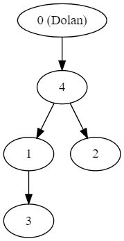

# Objectif

Une fois les comptes suspects identifiés, vous découvrez que les agents s'organisent comme un réseau tentaculaire qui semblent être organisés de manière hiérarchique avec Dolan à sa tête !

Chaque compte, à l'exception de Dolan, est placé sous la supervision d'un unique supérieur hiérarchique. Afin de mieux comprendre le fonctionnement de ce réseau et pour vous faire passer pour l'un d'entre eux, vous allez devoir produire une analyse du groupe à partir de ces liens hiérarchiques.

Les agents de niveau 2 sont ceux placés directement sous Dolan Grump. Les agents de niveau 3 sont ceux dont le supérieur est de niveau 2, et ainsi de suite.

Vous devez identifier combien d'agents appartiennent à chaque niveau de la hiérarchie.

# Données

## Entrée

Ligne 1 : Le nombre d'agents dans le réseau N, compris entre 1 et 1000
Lignes 2 à N : deux entiers A et B séparés par un espace, signifiant que l'agent B est le supérieur de l'agent A.

## Sortie

10 entiers séparés par des espaces, représentant le nombre d'agents de chaque niveau entre 1 et 10.

## Notes :
- Il y a au maximum 1000 agents dans le réseau
- Aucun agent n'a un niveau de plus de 10
- Chaque agent a exactement un supérieur, à l'exception de Dolan qui n'en a pas
- Dolan Grump est représenté par l'entier 0, et est toujours le seul au niveau 1

# Exemple

## Pour l'entrée :
5
1 4
3 1
4 0
2 4

## La réponse devra être :
1 1 2 1 0 0 0 0 0 0

La chaîne hiérarchique correspondante est la suivante :

